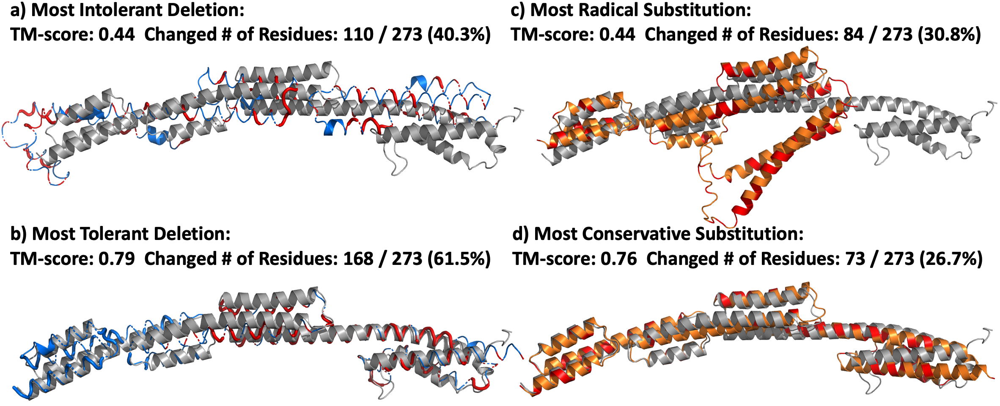

# ExplainableFold: Understanding AlphaFold Prediction with Explainable AI
## Overall
Pytorch implementation for paper "ExplainableFold: Understanding AlphaFold Prediction with Explainable AI", KDD 2023.


### Paper link: 
https://arxiv.org/abs/2301.11765

## Requirements
The ExplainableFold is based on OpenFold's implementation of AlphaFold2. To run these codes, first download the base model https://github.com/aqlaboratory/openfold and setup the environments accordingly.

## Instruction
1. To run the experiments, place the explainable_fold folder under the root folder of openfold.
2. Download AlphaFold database. Refer to instructions in https://github.com/deepmind/alphafold
3. To generate explanations on the test data, take "Most Intolerant Deletion" as example, run:
    ```
    python3 explainable_fold/exp_del.py \
    --fasta_dir explainable_fold/xfold_test/\
    --loss_type tm \
    --opt_type min \
    --alp 0.2 \
    --leaky 0.1 \
    --max_l 384 \
    --steps 100 \
    --delta_init equal\
    --output_dir ./explainable_fold/log \
    --model_device "cuda:0" \
    --lam 0.00001 \
    --lr 0.01 \
    --jackhmmer_binary_path lib/conda/envs/openfold_venv/bin/jackhmmer \
    --hhblits_binary_path lib/conda/envs/openfold_venv/bin/hhblits \
    --hhsearch_binary_path lib/conda/envs/openfold_venv/bin/hhsearch \
    --uniref90_database_path .../uniref90/uniref90.fasta \
    --mgnify_database_path .../mgnify/mgy_clusters_2018_12.fa \
    --bfd_database_path .../bfd/bfd_metaclust_clu_complete_id30_c90_final_seq.sorted_opt \
    --uniclust30_database_path .../uniclust30/uniclust30_2018_08/uniclust30_2018_08 \
    --pdb70_database_path .../pdb70/pdb70
    ```
    Remember to set the path to the MSAs database in your machine.
4. The generated counterfactual examples can be found in the ./explainable_fold/log folder.

## Reference
```
@inproceedings{tan2023explainablefold,
    author = {Tan, Juntao and Zhang, Yongfeng},
    title = {ExplainableFold: Understanding AlphaFold Prediction with Explainable AI},
    booktitle={Proceedings of the 29th ACM SIGKDD Conference on Knowledge Discovery and Data Mining},
    pages = {2166–2176},
    year = {2023}
}
```
